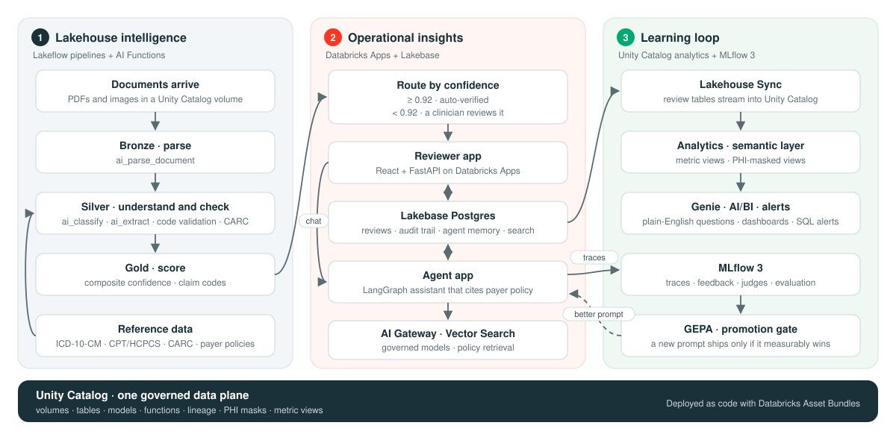

<p align="center">
  <picture>
    <source media="(prefers-color-scheme: dark)" srcset="assets/lakercm-logo-dark.svg">
    
  </picture>
</p>

<p align="center">
  <a href="https://www.databricks.com/solutions/accelerators"></a>
  
</p>

LakeRCM is a revenue cycle management accelerator on Databricks. It reads claims documents as they arrive, checks every diagnosis and procedure code against reference code sets, and sends only the uncertain documents to a clinician, who reviews them next to an agent that answers from the payer's policy and cites it. This is v0.1.0, the first public release.

Most denials are avoidable. Usually a code wasn't billable or a prior authorization was missing, and the fact that would have caught it was already sitting in a document or a payer policy. LakeRCM keeps the documents, code sets and payer policies on one governed data plane, so the pipeline can check every code and the reviewer can check the policy before the claim goes out. Reviewer decisions land there too, and the agent learns from them.

## How it works

1. A PDF or image lands in a Unity Catalog volume. A Lakeflow pipeline parses it with `ai_parse_document`, labels the document type with `ai_classify`, and pulls out the patient, payer, dates and codes with `ai_extract`.
2. The pipeline marks each ICD-10-CM and CPT/HCPCS code valid, invalid or non-billable, and maps denial reasons to CARC codes.
3. It scores the document by blending four confidence signals: extraction 50%, classification 20%, parsing 15% and completeness 15%. A document scoring 0.92 or higher is auto-verified unless it has an invalid or non-billable code or no member ID. Everything else goes to the review queue with its reasons recorded.
4. In the reviewer app, a clinician sees the extraction next to the source page. A LangGraph agent answers questions about the document, typed or dictated, and cites the payer-policy passage behind each answer. A knowledge graph links the document to its patient, payer, codes and policy; click a node to see the other documents that share it.
5. Lakebase Postgres stores the verdict, and Lakehouse Sync streams it back to Unity Catalog. From there it feeds the audit trail, the metric views, a Genie space, an AI/BI dashboard and SQL alerts.
6. MLflow traces every agent turn, and reviewer feedback plus scheduled LLM judges score them. GEPA proposes prompt changes, and a new prompt ships only if it beats the current one on held-out data: a composite gain of at least 0.02, no drop in safety, at least 20 paired examples, and a bootstrap confidence interval above zero.

## Architecture

<p align="center">
  
</p>

The pipelines, both apps, the agent's tools, the analytics and the evaluations all read the same Unity Catalog tables, so nothing gets copied out for reporting or training.

Lakebase Postgres is the operational database for both apps. It holds one review record per document, the agent's checkpoints and long-term memory (`PostgresSaver`, and `PostgresStore` with pgvector), and a hybrid document index that merges pgvector and full-text results with reciprocal-rank fusion. A synced table keeps it current with the gold extraction table, and Lakehouse Sync streams reviews back the other way. Neither direction needs an ETL job.

| Databricks capability | Used for |
|---|---|
| [Lakeflow Spark Declarative Pipelines](https://docs.databricks.com/aws/en/ldp/) + [AI Functions](https://docs.databricks.com/aws/en/large-language-models/ai-functions) | Parse, classify, extract and validate documents in a streaming medallion pipeline |
| [Unity Catalog](https://docs.databricks.com/en/data-governance/unity-catalog/index.html) | Governs the volumes, tables and models; masks PHI per persona; hosts the metric views |
| [Lakebase](https://docs.databricks.com/aws/en/oltp/) | Postgres for the apps: reviews, audit trail, conversations, agent memory and hybrid document search |
| [Databricks Apps](https://docs.databricks.com/aws/en/dev-tools/databricks-apps/) | Hosts the reviewer app and the agent, each acting on behalf of the signed-in user |
| [Vector Search](https://docs.databricks.com/aws/en/ai-search/ai-search) | Retrieves the payer-policy passages the agent cites |
| [AI Gateway](https://docs.databricks.com/aws/en/ai-gateway/) + [Foundation Model APIs](https://docs.databricks.com/aws/en/machine-learning/foundation-model-apis/) | Serves the agent's models behind one endpoint with traffic splitting, fallback and a payload table |
| [MLflow 3](https://docs.databricks.com/aws/en/mlflow3/genai/) | Tracing, human feedback, review queues, scheduled judges, evaluation and the prompt registry |
| [Genie](https://docs.databricks.com/aws/en/genie/) + [AI/BI dashboards](https://docs.databricks.com/aws/en/dashboards/) | Plain-English analytics, dashboards and alerts |
| [Declarative Automation Bundles](https://docs.databricks.com/aws/en/dev-tools/bundles/) | Declare everything above as code, per target |

## Repository layout

```
bundles/          One bundle per domain; there is no root databricks.yml
pipelines/        Lakeflow pipeline SQL: bronze, silver, gold
reviewer_app/     Reviewer app: FastAPI backend, React frontend, database migrations
agent_app/        LangGraph agent app, with its evaluation and prompt-optimization code
jobs/             Evaluation, dataset curation, GEPA and prompt-promotion jobs
synthetic_data/   Generator for the fictional demo documents
infra/ai_gateway/ Terraform for the production AI Gateway model service
assets/           Logo and architecture diagram
```

## Deploying

You need a workspace with Unity Catalog, serverless compute, Databricks Apps, Lakebase, Foundation Model APIs and Vector Search, plus Databricks CLI 1.17.0 or later, Python 3.11 and Node.js 20.

Workspace-specific settings are required variables in `bundles/_shared/variables.yml`, and [`.env.example`](.env.example) lists them as `BUNDLE_VAR_*` exports. Build the frontend (`npm ci && npm run build` in `reviewer_app/frontend`), then deploy each bundle with `databricks bundle deploy -t dev -C bundles/<name>`, in this order: foundation, reference_data, vector_search, lakebase, mlflow, pipelines, lakebase_sync, jobs, ai_gateway, apps, genie, observability, ontobricks. Start the apps with `databricks bundle run lakercm_app` and `databricks bundle run lakercm_agent_app` (`-C bundles/apps`). Don't use `databricks apps deploy`; it boots the apps without the environment the bundle sets.

Expect a partial environment. v0.1.0 doesn't include the deploy tooling, which also handled the setup no bundle can declare: grants for the apps' service principals; the reference code sets and payer policies; the MLflow experiment folders and Lakebase roles; the vector index, metric views, PHI masks and Lakehouse Sync feed; the rendered Genie space; and the OntoBricks source. Without it the documents pipeline fails on its first run, and the mlflow, genie and ontobricks bundles won't deploy to a fresh workspace. The synthetic document generator imports the same reference content, so it doesn't run in this release either.

## Data

Everything is synthetic. The generator in [`synthetic_data/`](synthetic_data/) builds the demo documents: Faker supplies the patients, clinics and identifiers (provider NPIs deliberately fail the check digit, so none can belong to a real provider), the payers are invented (Veridane, Solvara, Kestrel, Oakhollow and Silver Harbor), and Claude Opus 5.5 on the Foundation Model APIs writes the narrative. The repository has no documents or data files, and no real PHI or customer data.

## Project support

Please note the code in this project is provided for your exploration only, and are not formally supported by Databricks with Service Level Agreements (SLAs). They are provided AS-IS and we do not make any guarantees of any kind. Please do not submit a support ticket relating to any issues arising from the use of these projects. The source in this project is provided subject to the Databricks [License](./LICENSE.md). All included or referenced third party libraries are subject to the licenses set forth below.

Any issues discovered through the use of this project should be filed as GitHub Issues on the Repo. They will be reviewed as time permits, but there are no formal SLAs for support.

## Disclaimers

Databricks Inc. (“Databricks”) does not dispense medical, diagnosis, or treatment advice. This Solution Accelerator (“tool”) is for informational purposes only and may not be used as a substitute for professional medical advice, treatment, or diagnosis. This tool may not be used within Databricks to process Protected Health Information (“PHI”) as defined in the Health Insurance Portability and Accountability Act of 1996, unless you have executed with Databricks a contract that allows for processing PHI, an accompanying Business Associate Agreement (BAA), and are running this notebook within a HIPAA Account.  Please note that if you run this notebook within Azure Databricks, your contract with Microsoft applies.

## Third-party package licenses

&copy; 2026 Databricks, Inc. All rights reserved. The source in this project is provided subject to the Databricks License [https://databricks.com/db-license-source]. All included or referenced third party libraries are subject to the licenses set forth below.

| Package | License | Source |
|---------|---------|--------|
| databricks-sdk | Apache-2.0 | https://github.com/databricks/databricks-sdk-py |
| mlflow | Apache-2.0 | https://github.com/mlflow/mlflow |
| databricks-agents | Databricks License | https://pypi.org/project/databricks-agents/ |
| langgraph, langgraph-prebuilt, langgraph-checkpoint-postgres | MIT | https://github.com/langchain-ai/langgraph |
| langchain, langchain-core, langchain-community, langchain-openai | MIT | https://github.com/langchain-ai/langchain |
| ag-ui-langgraph, @ag-ui/client | MIT | https://github.com/ag-ui-protocol/ag-ui |
| gepa | MIT | https://github.com/gepa-ai/gepa |
| fastapi | MIT | https://github.com/fastapi/fastapi |
| pydantic, pydantic-settings | MIT | https://github.com/pydantic/pydantic |
| uvicorn | BSD-3-Clause | https://github.com/Kludex/uvicorn |
| httpx | BSD-3-Clause | https://github.com/encode/httpx |
| sse-starlette | BSD-3-Clause | https://github.com/sysid/sse-starlette |
| SQLAlchemy | MIT | https://github.com/sqlalchemy/sqlalchemy |
| alembic | MIT | https://github.com/sqlalchemy/alembic |
| psycopg, psycopg-pool | LGPL-3.0-only | https://github.com/psycopg/psycopg |
| opentelemetry-distro and instrumentation | Apache-2.0 | https://github.com/open-telemetry/opentelemetry-python-contrib |
| python-multipart | Apache-2.0 | https://github.com/Kludex/python-multipart |
| python-dateutil | Apache-2.0 or BSD-3-Clause | https://github.com/dateutil/dateutil |
| psutil | BSD-3-Clause | https://github.com/giampaolo/psutil |
| cachetools | MIT | https://github.com/tkem/cachetools |
| pytz | MIT | https://pypi.org/project/pytz/ |
| react, react-dom | MIT | https://github.com/react/react |
| react-router | MIT | https://github.com/remix-run/react-router |
| react-markdown, remark-gfm | MIT | https://github.com/remarkjs |
| axios | MIT | https://github.com/axios/axios |
| date-fns | MIT | https://github.com/date-fns/date-fns |
| vite, @vitejs/plugin-react (build only) | MIT | https://github.com/vitejs/vite |
| faker (synthetic data) | MIT | https://github.com/joke2k/faker |
| reportlab (synthetic data) | BSD | https://www.reportlab.com/opensource/ |

[NOTICE.md](NOTICE.md) groups the same packages by license.

## Maintainers

Makhoul Cassis ([@makhoul-cassis](https://github.com/makhoul-cassis)) at Databricks. Report security issues as described in [SECURITY.md](SECURITY.md).
